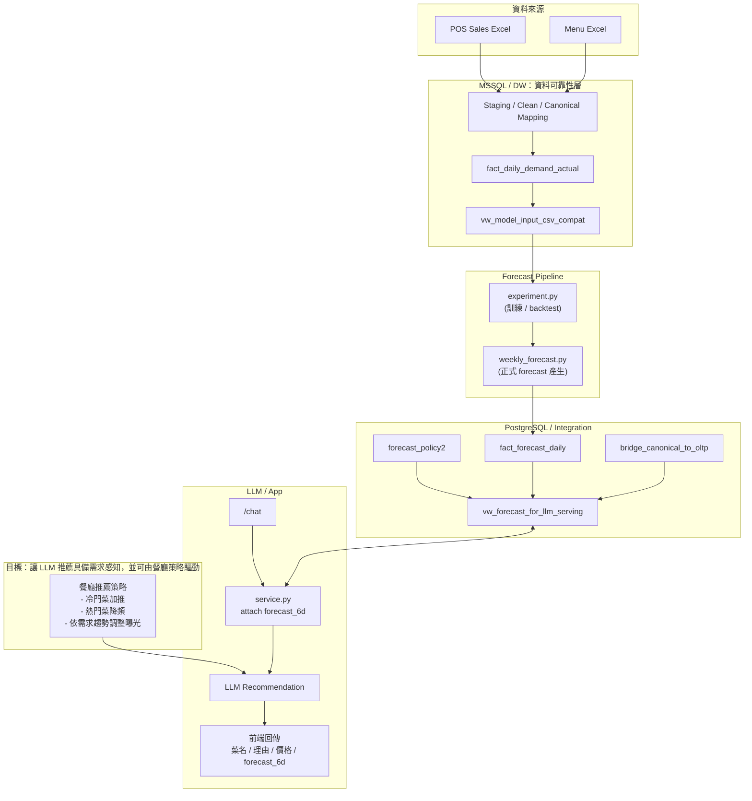
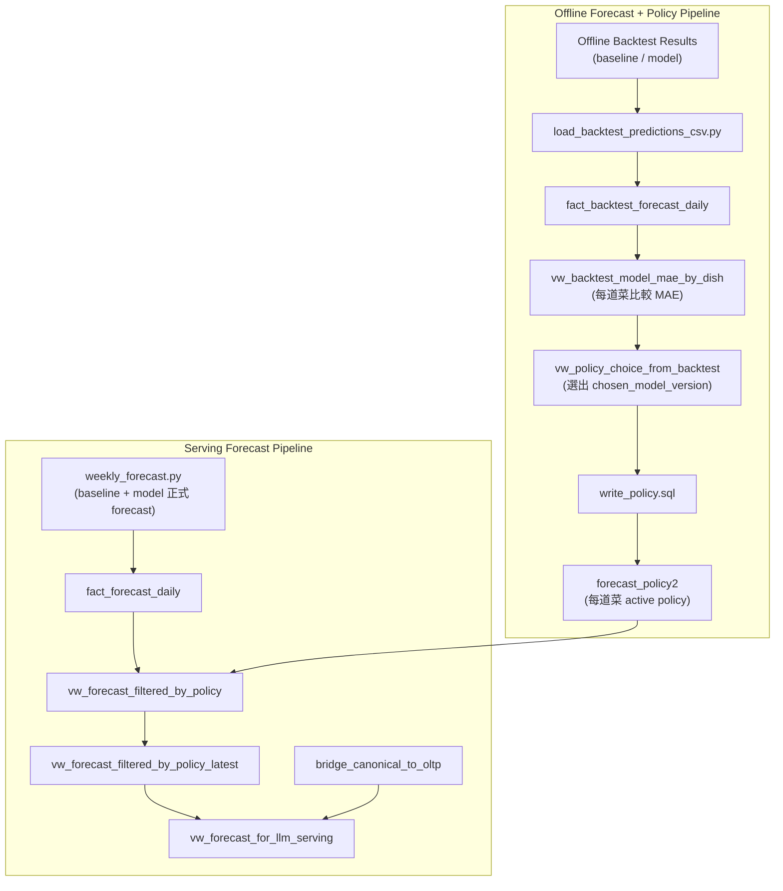

# 需求預測驅動的 LLM 點餐推薦系統

> 從 POS 資料、Data Warehouse、需求預測到 LLM 推薦的端到端 AI 系統

## 0. Project Highlights

本專案實作一個結合 **需求預測與 LLM 推薦** 的 AI 點餐系統，  
將餐廳營運資料納入推薦決策流程。

系統包含以下核心設計：

- 建立 **Data Warehouse**，將 POS 營運資料轉換為穩定的需求序列
- 建立 **需求預測模型實驗平台（`aiorderfood-ml`）**，進行模型訓練與回測
- 透過 **forecast pipeline** 產生未來需求預測
- 設計 **policy layer**，確保模型能安全地進入營運系統
- 在 LLM 推薦系統中查詢需求預測，實現 **forecast-aware recommendation**

整體系統形成一條從 **資料 → 模型 → 推薦決策** 的完整 AI pipeline。

## 1. Project Context

多數 LLM 點餐推薦只依賴自然語言與菜單資訊，  
例如根據「口味描述」推薦菜品。

然而在真實餐廳營運中，  
推薦策略往往需要同時考量營運資料，例如：

- 歷史銷量
- 近期需求變化
- 店家的營運策略

因此，本專案將 **需求預測資料整合進 LLM 推薦系統**，  
讓 LLM 在產生推薦結果時可以同時取得未來需求資訊。

目前系統已具備 **forecast-aware recommendation** 的能力，
推薦結果會附帶未來需求預測（forecast）。

在此基礎上，  
未來可進一步加入 **strategy layer**，  
依據餐廳營運策略調整推薦排序，例如：

- 提升冷門菜曝光
- 分散熱門菜需求壓力
- 避免推薦可能缺貨的菜品

讓推薦系統從單純的語言助手，  
逐步升級為 **餐廳營運決策的輔助工具**。

---

## 2. Problem

> 如何讓需求預測模型安全地進入營運決策層？

在實驗環境中建立預測模型通常並不困難，  
但要將模型安全地整合進營運系統，  
必須先解決資料與系統設計上的問題。

其中一個核心問題來自於 POS 的資料結構。

POS 中的 `FoodID` 是營運紀錄鍵（operational key），  
而不是分析上穩定的菜品實體。

在實務資料中可能出現：

- 相同菜品在不同時間被重新輸入 POS，產生不同 `FoodID`

如果模型直接使用 `FoodID` 建立需求序列：

- 同一道菜的銷量會被拆成多條序列，  
  導致模型學到的需求結構失真。

這代表 POS 的營運資料無法直接作為穩定的需求序列來源。

因此，在建立需求預測之前，  
**必須先建立一個能夠提供穩定需求序列的資料層**。

本專案透過 **Data Warehouse 設計**，  
將 POS 的營運資料轉換為可用於需求預測的分析資料。

然而，穩定的資料層只是第一步。

在此基礎上，  
仍需要一套完整的系統設計，  
將資料處理、模型預測與推薦系統串接在一起。

下一節將介紹本專案的整體系統架構與資料流程。

## 3. System Architecture

本專案將需求預測整合進點餐推薦系統中，
整體系統可分為三個主要層次：

### Data Layer

負責將 POS 營運資料轉換為可分析的需求序列。

### Forecast Layer

負責需求預測模型的訓練與未來需求預測的產生。

### Application Layer

將需求預測資料整合進點餐推薦系統，
並在推理階段提供 LLM 查詢。

整體系統架構如下：

```
POS Sales Data
        │
        ▼
Data Warehouse (MSSQL)
Canonical Mapping / Clean Views / Demand Fact
        │
        ▼
Forecast Experiment Platform
(aiorderfood-ml repo)
Model Training & Backtesting
        │
        ▼
Forecast Pipeline
(weekly_forecast)
Generate Future Demand
        │
        ▼
Policy Layer
Model Selection / Safety Controls
        │
        ▼
LLM Recommendation System
Query Forecast & Attach Predictions
        │
        ▼
Ordering Interface
```

### End-to-end architecture



在此架構中，**Data Warehouse** 提供穩定的需求資料來源，
而模型訓練則在獨立的實驗平台 `aiorderfood-ml` 中進行。

模型訓練完成後，
預測結果會透過 **Forecast Pipeline** 進入系統資料庫，
並由推薦系統在推理階段查詢。

### 3.1 Data Flow

在此架構中，資料從 POS 營運系統開始，  
經由 Data Warehouse 轉換為需求資料，  
再進入需求預測與推薦系統。

系統中的資料流程可分為五個主要階段：

### 1. Data Ingestion — POS 資料匯入 Data Warehouse

POS 每日銷量資料由營運系統匯出，
並匯入 Data Warehouse 的 **staging layer**。

在此階段資料仍保留原始結構，
作為後續資料轉換與追溯的來源。

---

### 2. Data Modeling — Data Warehouse 建立需求序列

Data Warehouse 負責將營運資料轉換為可分析的需求資料。

此過程包含：

- canonical mapping：將 POS `FoodID` 對應至穩定的菜品實體
- data cleaning：處理缺失資料與異常值
- demand fact table：建立每日需求資料表

轉換完成後，
需求資料會以 **dish × date** 為粒度存放於 fact table，
作為模型訓練與系統查詢的統一資料來源。

---

### 3. Model Training — 模型實驗平台訓練需求預測模型

模型訓練在獨立的實驗平台 **`aiorderfood-ml`** 中進行。

實驗平台會：

- 讀取 Data Warehouse view 作為訓練資料
- 建立特徵工程流程
- 進行模型訓練與時間序列回測

最終輸出訓練好的模型與評估結果。

---

### 4. Forecast Generation — Forecast Pipeline 產生未來需求

系統定期執行 **forecast pipeline**，
載入訓練完成的模型並產生未來需求預測。

預測結果會寫入系統資料庫，
形成可供應用層查詢的 forecast 資料。

---

### 5. Application Query — 推薦系統查詢預測資料

LLM 推薦系統在推理階段查詢 forecast 資料，
並將需求預測附加至推薦結果中。

目前系統提供 **forecast-aware recommendation**，
使推薦結果能同時包含：

- 菜品資訊
- 推薦理由
- 未來需求預測

## 4. Risk Control Design

在將需求預測整合進營運系統時，
模型準確度並不是唯一需要考量的因素。

即使模型在回測中表現良好，
在真實系統中仍可能出現以下風險：

- 預測資料尚未更新
- 模型版本不一致
- 部分菜品缺少預測資料
- 系統查詢到過期預測

因此，本專案在系統層設計了 **Risk Control Layer**，
確保需求預測在進入推薦系統之前，
經過基本的安全檢查與策略控制。

### 4.1 Baseline Fallback

在需求預測系統中，  
模型並不是唯一的預測來源。

系統同時提供 **baseline 預測模型**，  
作為安全回退機制。

baseline 通常使用簡單且穩定的統計方法，例如：

依據 **dish × day-of-week** 的歷史中位數

或其他穩定的需求估計方式

當模型預測無法使用時，  
系統可以回退到 baseline，  
確保推薦系統仍能取得合理的需求資訊。

### 4.2 Forecast Coverage Gate

推薦系統在查詢預測資料時，  
需要確保預測資料仍在有效範圍內。

例如：

- 若系統只產生未來 **6 天預測**
- 而查詢日期超出預測範圍

則推薦系統不應使用過期預測。

因此在查詢 forecast 時，  
系統會先檢查 **forecast coverage**，  
確保預測資料仍在有效時間區間內。

### 4.3 Data Quality Checks

在資料進入需求預測流程之前，  
Data Warehouse 會進行基本的資料品質檢查，例如：

- 檢查銷量是否為負值
- 檢查是否存在缺失日期
- 檢查資料是否出現重複紀錄

這些檢查能確保需求序列的基本品質，  
避免資料異常影響模型訓練與預測結果。

## 5. Data Warehouse Design

Data Warehouse 的主要目標是：

> 將 POS 的營運紀錄轉換為穩定的需求資料來源。

POS 系統中的資料通常以營運需求為主，  
並不一定適合直接用於分析或建模。

因此，本專案透過 Data Warehouse  
建立一層 **分析導向的資料模型**。

### 5.1 Canonical Dish Mapping

POS 的 `FoodID` 並不是穩定的菜品識別鍵。

在實務資料中，
相同菜品可能因為重新輸入 POS
而產生不同的 `FoodID`。

為了建立穩定的需求序列，
系統建立 **canonical dish mapping**，
將不同 `FoodID` 對應至同一個菜品實體。

此設計使需求序列能以 **菜品實體** 為單位進行建模，
而不是依賴不穩定的 POS key。

### 5.2 Demand Fact Table

需求資料以 **每日菜品需求** 為粒度儲存。

```
grain:
dish × date
```

此 fact table 同時提供：

- 模型訓練資料來源
- 系統查詢需求資料

確保整個系統使用 **一致的需求定義**。

### 5.3 Complete Time Series

POS 銷量資料通常只有在有銷售時才會產生紀錄。

若直接使用原始資料建立需求序列，
可能會出現缺失日期。

Data Warehouse 會補齊缺失日期，
建立 **完整的每日需求序列**，
確保時間序列模型能正常運作。

### 5.4 Date Dimension

系統建立 `dim_date` 維度表，
提供時間相關資訊，例如：

- day of week
- 是否為店休日
- 其他日曆特徵

這些資訊可用於：

- 特徵工程
- BI 分析
- 系統查詢

## 6. Forecast Pipeline

模型訓練完成後，
需求預測會透過 **forecast pipeline**
整合進營運系統。

forecast pipeline 的主要功能包含：

- 載入訓練完成的模型
- 產生未來需求預測
- 將預測結果寫入系統資料庫

系統目前透過 `weekly_forecast` pipeline
定期產生未來需求預測。

### 6.1 Forecast Generation

forecast pipeline 會：

1. 讀取 Data Warehouse 中的需求資料
2. 載入訓練完成的模型
3. 產生未來需求預測

預測結果通常包含：

- canonical dish id
- target date
- predicted demand

### 6.2 Forecast Storage

預測結果會寫入系統資料庫中的 forecast table，
作為應用層查詢的資料來源。

此設計讓：

- LLM 推薦系統
- 其他應用服務

都能透過資料庫查詢需求預測。

## 7. Policy Control Loop

在系統中，
模型預測並不會直接被使用。

系統會透過 **policy layer**
決定實際提供給應用層的預測來源。

這個過程形成一個簡單的 **control loop**：

```
Backtesting
      │
      ▼
Model Evaluation
      │
      ▼
Policy Selection
      │
      ▼
Serving Forecast
```

### Offline policy selection flow



系統可根據回測結果，
選擇最適合的模型版本。

在目前的設計中，
policy layer 主要負責：

- 管理模型版本
- 控制 forecast 來源
- 確保系統使用穩定的預測資料

## 8. LLM Integration

在推薦系統中，
LLM 會在推理階段查詢需求預測資料。

系統提供一個整合 view：

```
vw_forecast_for_llm_latest
```

此 view 提供：

- 菜品識別
- 未來需求預測
- policy 控制後的 forecast

LLM 在產生推薦結果時，
會將 forecast 資料附加到推薦內容中。

這使推薦系統具備 **forecast-aware recommendation**，
推薦結果不僅包含菜品資訊與推薦理由，
也包含未來需求預測。

## 9. Milestones

本專案從資料處理開始，
逐步建立需求預測與推薦系統整合的完整 pipeline。

目前已完成的主要系統模組包括：

### Data Warehouse

- 建立 POS 銷量資料的 **staging layer**
- 設計 **canonical dish mapping**
- 建立需求 fact table（dish × date）
- 建立完整時間序列與 `dim_date` 維度表

### Forecast System

- 建立需求預測 模型實驗平台（aiorderfood-ml）
- 建立時間序列 backtesting pipeline
- 訓練需求預測模型（baseline / LightGBM）

### Forecast Pipeline

- 建立 weekly forecast pipeline
- 產生未來需求預測
- 將預測資料寫入系統資料庫

### Policy Layer

- 建立 forecast policy 控制層
- 支援 baseline fallback
- 控制系統實際使用的 forecast 來源

### LLM Integration

- 建立 LLM 推薦系統
- 查詢 forecast view
- 將需求預測附加至推薦結果

### Next Steps

未來可進一步擴充系統能力，例如：

- 將 **庫存資訊** 整合進推薦策略
- 建立 **多店需求預測**
- 建立 **策略層（strategy layer）** 控制推薦排序
- 建立 **BI dashboard** 監控需求與預測表現

## 10. Repository Structure

```
aiorderfood
│
├─ app/                  # FastAPI backend 與推薦服務
│  ├─ modules/           # 點餐、菜單、登入、聊天等 API 模組
│  ├─ forecasting/       # 預測服務邏輯
│  ├─ forecast_pg/       # 預測結果寫入 PostgreSQL
│  └─ pipeline/          # 正式 forecast pipeline
│
├─ dw_mssql/             # Data Warehouse (MSSQL)
├─ pg_integration/       # DW → OLTP integration / offline policy
├─ static/               # Vue 前端專案
└─ docs/                 # 系統設計文件
```

## Related Repository

需求預測模型的訓練與回測
在獨立的實驗平台中進行：

**`aiorderfood-ml`**

此 repo 提供：

- feature engineering pipeline
- model training
- time-based backtesting
- model artifact export

訓練完成的模型會由
`aiorderfood` 的 **forecast pipeline** 載入並產生需求預測。
