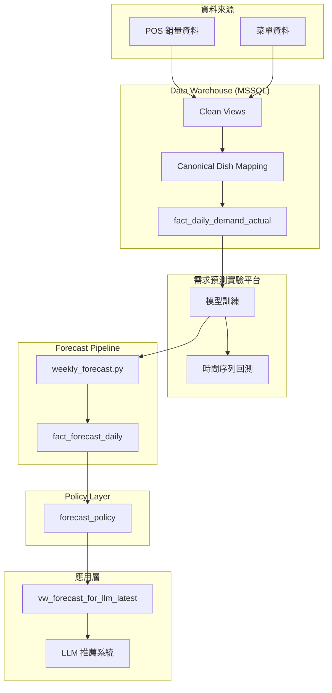
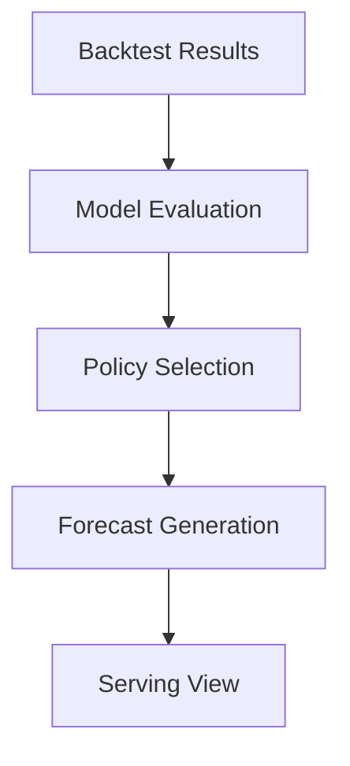

# AIOrderFood

> Bringing demand forecasting into LLM-based restaurant recommendation.  
> 需求預測驅動的 LLM 點餐推薦系統

本專案實作一個 **端到端 AI 系統**，  
將餐廳營運資料、需求預測模型與 LLM 推薦整合在一起。

系統目標是讓推薦系統不只依賴語言理解，  
而是能夠結合 **未來需求預測（forecast-aware recommendation）**，  
為餐廳營運提供決策輔助。

---

# Key Features

| Feature                     | Description                             |
| --------------------------- | --------------------------------------- |
| Demand-aware recommendation | LLM 推薦結合未來需求預測                |
| Canonical dish identity     | 建立穩定的菜品實體層，避免 POS key 漂移 |
| Time-series backtesting     | 使用時間序列回測評估需求預測模型        |
| Forecast policy control     | 根據回測結果選擇 serving 模型           |
| Baseline fallback           | 模型失效時自動回退到統計基準模型        |
| LLM integration             | 在推薦結果中附加需求預測資訊            |

---

# Tech Stack

| Layer               | Technology |
| ------------------- | ---------- |
| Backend             | FastAPI    |
| Database            | PostgreSQL |
| Data Warehouse      | MSSQL      |
| ML Framework        | LightGBM   |
| Experiment Platform | Python     |
| LLM                 | OpenAI API |
| Frontend            | Vue        |

---

# 系統架構



整體系統將 **營運資料 → 需求預測 → LLM 推薦** 串接成完整 AI pipeline。

---

# 核心設計決策

| 問題                     | 設計                        |
| ------------------------ | --------------------------- |
| POS `FoodID` 不穩定      | 建立 canonical dish mapping |
| 銷量資料只在有銷售時出現 | 建立完整時間序列            |
| 模型可能不穩定           | baseline fallback           |
| 需要公平比較模型         | time-based backtesting      |
| 模型部署需要安全機制     | policy layer                |
| LLM 需要簡單資料接口     | forecast serving view       |

---

# 系統模組

| 層級              | 職責                          | 主要元件                     |
| ----------------- | ----------------------------- | ---------------------------- |
| Data Warehouse    | 清理 POS 資料並建立需求序列   | `fact_daily_demand_actual`   |
| 模型實驗平台      | 訓練與評估需求預測模型        | `experiment.py`              |
| Forecast Pipeline | 產生未來需求預測              | `weekly_forecast.py`         |
| Policy Layer      | 根據回測結果選擇 serving 模型 | `forecast_policy`            |
| LLM Integration   | 將需求預測附加至推薦結果      | `vw_forecast_for_llm_latest` |

---

# Forecast Policy Flow



系統會根據回測結果決定實際提供給應用層的預測來源。

---

# Repository Structure

```
aiorderfood
│
├─ app/                        # FastAPI application
│  │
│  ├─ modules/                 # API modules
│  │  └─ chat/
│  │     ├─ router.py
│  │     └─ service.py         # LLM 推薦服務（attach forecast）
│  │
│  ├─ pipeline/                # forecast generation pipeline
│  ├─ dw_mssql/                # Data Warehouse schema & ETL
│  └─ pg_integration/          # forecast policy & serving layer
│
├─ static/                     # Vue 前端
└─ docs/                       # 系統設計文件
```

---

# Related Repository

需求預測模型的訓練與回測在獨立 repo 中完成：

**aiorderfood-ml**

```
Data Warehouse
      ↓
aiorderfood-ml
(模型訓練 / 回測)
      ↓
trained model artifact
      ↓
aiorderfood
(forecast pipeline / LLM integration)
```

此設計讓：

- 模型實驗
- 系統整合

可以獨立演進。
