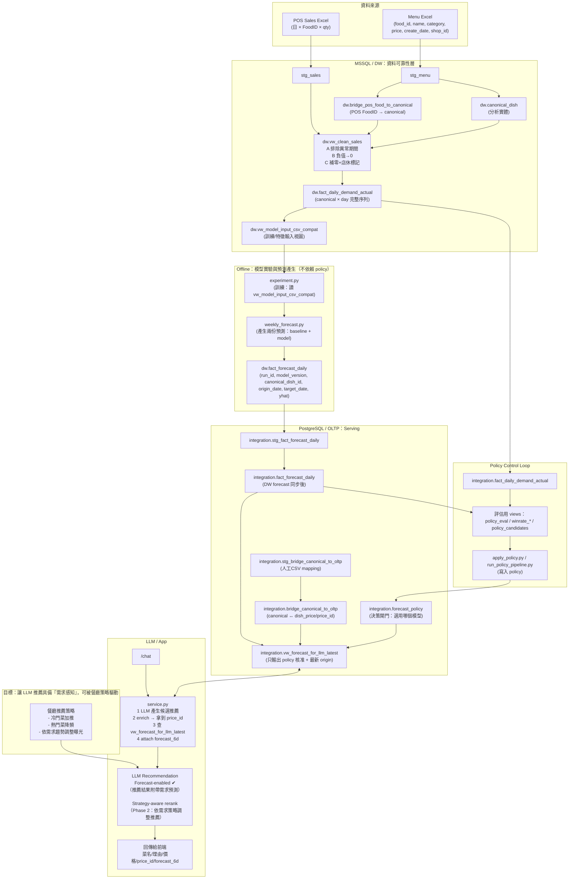

```mermaid
flowchart TB
 subgraph GOAL["目標：讓 LLM 推薦具備『需求感知』，可被餐廳策略驅動"]
        STRAT["餐廳推薦策略<br>- 冷門菜加推<br>- 熱門菜降頻<br>- 依需求趨勢調整曝光"]
  end
 subgraph SRC["資料來源"]
        POS["POS Sales Excel<br>(日 × FoodID × qty)"]
        MENU["Menu Excel<br>(food_id, name, category, price, create_date, shop_id)"]
  end
 subgraph DW["MSSQL / DW：資料可靠性層"]
        STG_S["stg_sales"]
        STG_M["stg_menu"]
        CANON["dw.canonical_dish<br>(分析實體)"]
        BR_POS["dw.bridge_pos_food_to_canonical<br>(POS FoodID → canonical)"]
        CLEAN["dw.vw_clean_sales<br>A 排除異常期間<br>B 負值→0<br>C 補零+店休標記"]
        FACT_A["dw.fact_daily_demand_actual<br>(canonical × day 完整序列)"]
        V_INPUT["dw.vw_model_input_csv_compat<br>(訓練/特徵輸入視圖)"]
  end
 subgraph OFF["Offline：模型實驗與預測產生（不依賴 policy）"]
        TRAIN["experiment.py<br>(訓練：讀 vw_model_input_csv_compat)"]
        WF["weekly_forecast.py<br>(產生兩份預測：baseline + model)"]
        FACT_F["dw.fact_forecast_daily<br>(run_id, model_version, canonical_dish_id, origin_date, target_date, yhat)"]
  end
 subgraph OLTP["PostgreSQL / OLTP：Serving"]
        STG_F_PG["integration.stg_fact_forecast_daily"]
        F_PG["integration.fact_forecast_daily<br>(DW forecast 同步後)"]
        STG_B["integration.stg_bridge_canonical_to_oltp<br>(人工CSV mapping)"]
        B_CANON["integration.bridge_canonical_to_oltp<br>(canonical ↔ dish_price/price_id)"]
        POLICY["integration.forecast_policy<br>(決策閘門：選用哪個模型)"]
        V_SERVE["integration.vw_forecast_for_llm_latest<br>(只輸出 policy 核准 + 最新 origin)"]
  end
 subgraph LOOP["Policy Control Loop"]
        SYNC_A["integration.fact_daily_demand_actual"]
        V_EVAL["評估用 views：<br>policy_eval / winrate_* / policy_candidates"]
        APPLY["apply_policy.py / run_policy_pipeline.py<br>(寫入 policy)"]
  end
 subgraph APP["LLM / App"]
        CHAT["/chat"]
        SVC["service.py<br>1 LLM 產生候選推薦<br>2 enrich → 拿到 price_id<br>3 查 vw_forecast_for_llm_latest<br>4 attach forecast_6d"]
        LLM["LLM Recommendation<br>Forecast-enabled ✔<br>（推薦結果附帶需求預測）<br><br>Strategy-aware rerank<br>（Phase 2：依需求策略調整推薦）"]
        OUT["回傳給前端<br>菜名/理由/價格/price_id/forecast_6d"]
  end
    STRAT --> LLM
    POS --> STG_S
    MENU --> STG_M
    STG_M --> CANON & BR_POS
    STG_S --> CLEAN
    BR_POS --> CLEAN
    CANON --> CLEAN
    CLEAN --> FACT_A
    FACT_A --> V_INPUT & SYNC_A
    V_INPUT --> TRAIN
    TRAIN --> WF
    WF --> FACT_F
    FACT_F --> STG_F_PG
    STG_F_PG --> F_PG
    STG_B --> B_CANON
    F_PG --> V_SERVE & V_EVAL
    B_CANON --> V_SERVE
    POLICY --> V_SERVE
    SYNC_A --> V_EVAL
    V_EVAL --> APPLY
    APPLY --> POLICY
    CHAT --> SVC
    SVC --> LLM
    LLM --> OUT
    V_SERVE <--> SVC
```
